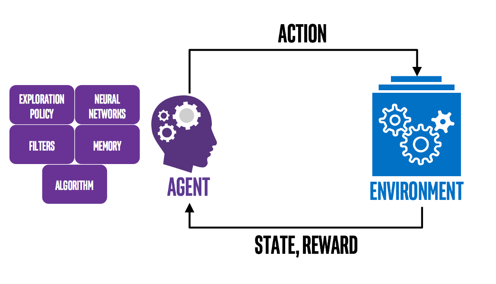
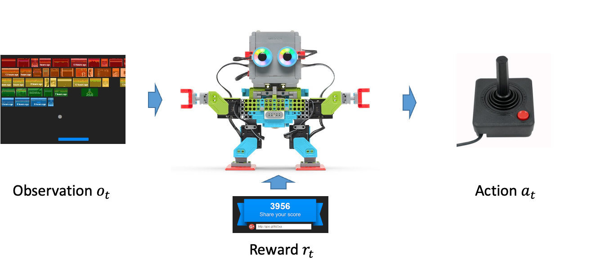

+++
date = '2025-10-28T15:23:52+08:00'
title = 'RL Note 1: Basics'
tags = ['Course Notes', 'Reinforcement Learning']
categories = ['Learning']
+++

# Prologue
It’s been a while since I last updated this blog, so I’m kicking off a new series.

I’m currently taking a Reinforcement Learning (RL) course taught by Prof. [Hongning Wang](https://coai.cs.tsinghua.edu.cn/hw-ai/index.html). I’m really enjoying his lectures and carefully prepared notes, and I’ve quickly grown fond of RL.

I’ve decided to turn the course material into a series of blog posts—not only to deepen my own understanding, but also in the hope that it helps other readers. The series will largely follow the [Fall 2025 Reinforcement Learning course](https://coai.cs.tsinghua.edu.cn/Courses/RL2025/_site/index.html), but rather than simply repeating the lecture slides, I’ll add my own insights. I’ll also place extra emphasis on the mathematics—equations and proofs—which I find both challenging and especially interesting.

The major topics of this series are:
- Basics of Reinforcement Learning
- Multi-Armed Bandits
- Markov Decision Processes (MDPs)
- Dynamic Programming
- Monte Carlo Methods
- Temporal-Difference Learning
- Policy Gradient Methods
- Function Approximation
- Deep Reinforcement Learning

I’ll cover each of these in its own post.

Today’s topic introduces the basic concepts of RL, which are foundational for everything that follows. As Prof. Wang noted in class, these fundamentals capture much of what RL is about.

Let’s begin our journey into Reinforcement Learning!

# What is Reinforcement Learning?
<span id='rl-in-short'>In short, reinforcement learning is about an agent that continually updates its policy—how it selects actions—based on feedback from the environment, with the goal of maximizing future cumulative reward.</span>

The figure below illustrates this process:
<span id='image-rl-overview'></span>

You now have a broad picture of RL. To go deeper, we need to clarify a few core concepts that will ground the discussions to come:
- Action vs. Reward
- State vs. Value
- Policy
- Model

# Action vs. Reward
## Definitions
These concepts are easy to understand, but they are two of the most important components in RL. First, the definitions:
```callout {title="Definition: Action"}
A choice made from the options presented by the environment.
```

```callout {title="Definition: Reward"}
The scalar feedback signal for the action taken.
```

These definitions seem simple, but a few points are worth noting.
## What does 'presented options' mean?
This means the agent does not decide the options: they are given by the environment, and the agent can only choose among them.

## The Goal of RL
Nowadays, when researchers train LLMs with RL methods, they often use reward as a key metric to evaluate performance, which leads to a common misconception: that RL tries to maximize the reward of a single action. This is wrong because the true feedback may be delayed. Some actions that seem good now may lead to increasingly worse situations, while some actions that seem not so good now may turn out to be wise after a few steps. Hence, [as summarized before](#rl-in-short):

```callout {.tip title="The Goal of Learning From the Perspective of Reward"}
The goal of learning is to maximize **cumulative** reward.
```

In other words, all goals can be described by the maximization of expected cumulative reward. However, because reward is often manually designed, this statement assumes the reward design is good enough. Reward really counts!

# State vs. Value
These two concepts are closely related to [Action vs. Reward](#action-vs-reward). First, let’s see how an agent takes an action in RL:

## How does the agent take an action?
As shown in the [figure](#image-rl-overview) above, we can abstract the RL process as:
<span id='eq_oar'>
$$
o_1, a_1, r_1, \ldots, o_t, a_t, r_t, \ldots, o_T, a_T, r_T
$$
</span>
where $o$ denotes observations, $a$ denotes actions, and $r$ denotes rewards; $t$ is the current time step; $k<t$ refers to the history, and $k>t$ refers to the predicted future.

This sequence describes the standard RL loop: the agent observes the environment, chooses an action, receives feedback, and then observes the updated environment, and so on so forth.



This [sequence](#eq_oar) highlights two key ideas:
1. We care about the **history**, because it helps indicate which actions are good or bad.
2. We care about the **future**, because we want the agent to perform well over time, not just at the current step.

This leads to the following definitions:
## Definitions
```callout {.info title="Definition: State"}
A function of the **history**.
$$
s_t = f(o_1, a_1, r_1, \ldots, o_t)
$$
```

```callout {title="Definition: Value"}
A function that evaluates how good the current state is for the **future**.
We usually consider two value functions:
- State–action value:
$$
v_\pi(s_t, a_t) = \mathbb{E}_\pi\left[ \sum_{i=t}^T \gamma^{i-t} r_i \right]
$$

- State value:
$$
v_\pi(s_t) = \mathbb{E}_{a_t \sim \pi(s_t)}\!\left[ v_\pi(s_t, a_t) \right]
$$
```

Further notes:

### What does the subscript $\pi$ mean?
It denotes the policy, i.e., the probability of taking each action in the current situation(we will give the formal definition later). In the definitions above, the policy $\pi$ is fixed, so we evaluate value under a given policy. We may later adjust the policy based on the value function.

### How to interpret the $\mathbb{E}$?
- For the state–action value: environments are complex; future rewards and observations are uncertain given a current state–action pair. We therefore take the expectation over all possible future trajectories.
- For the state value: the expectation is over actions (according to $\pi$) to evaluate how good the current state is.

### What does $\gamma$ mean?
It is the discount factor for future rewards. Because future outcomes are less certain than immediate ones, we gradually downweight them. Typically, $0 \leq \gamma < 1$.

Hence, [the goal of RL](#the-goal-of-rl) can be clarified more accurately as:
```callout {.tip title="The Goal of Learning From the Perspective of Value"}
The goal of learning is to find the highest value states.
```

# Policy
We introduced the idea of policy [earlier](#what-does-the-subscript-pi-mean); here is the precise definition.

```callout {title="Definition: Policy"}
A policy maps each state to a probability distribution over actions:
$$
\pi : \mathcal S \to \Delta(\mathcal A), \quad \text{so } \pi(a \mid s) = \Pr(A=a \mid S=s).
$$
Here $\Delta(\mathcal A)$ denotes the probability simplex over $\mathcal A$—all non‑negative vectors on $\mathcal A$ whose entries sum to 1.
```

# Model
```callout {title="Definition: Model"}
The model is the agent’s estimated view of the environment.
```

```callout {.tip title="Model vs. Environment"}
The environment exists objectively, whereas the model is merely the agent’s estimate, inferred from history.
```

# Conclusion
We have sketched the core ingredients of reinforcement learning—reward, value, policy, and model—and highlighted why cumulative return matters more than any single outcome.

```callout {.tip title="Key takeaways"}
- Actions are choices from environment-provided options, and rewards are the scalar feedback signals we must consider **cumulatively**, not step by step.
- States summarize **history**, while value functions estimate **future** return.
- A policy maps each state to a distribution over actions, defining the agent’s behaviour.
- The model is the agent’s estimate of the environment.
```

For a worked example that ties these ideas together, I recommend pages 8–12 of [Prof. Wang’s Lecture 1 slides](https://coai.cs.tsinghua.edu.cn/Courses/RL2025/_site/static_files/ppt/basics.pptx); they walk through Dijkstra’s algorithm from an RL perspective with carefully prepared animations—far better than screenshots I could share (and, honestly, I’m too lazy to recreate them here).

Thanks for reading, and I hope this series continues to help with your own learning journey.
