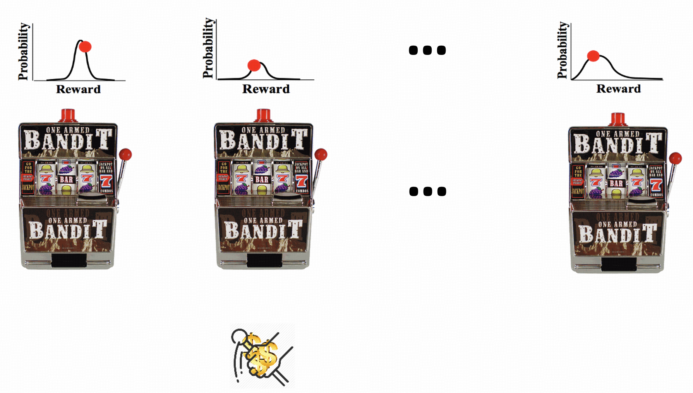
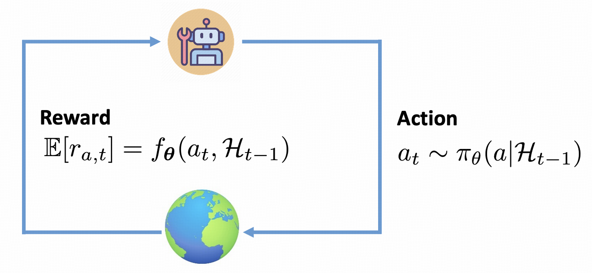
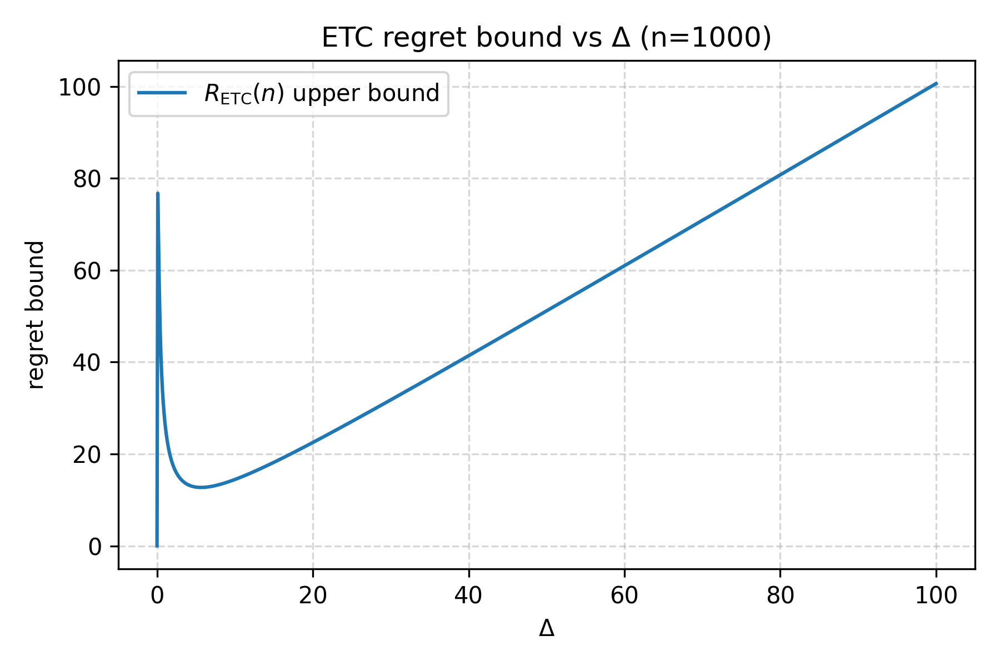
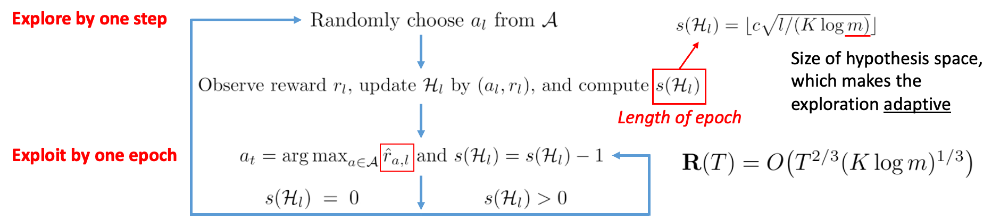
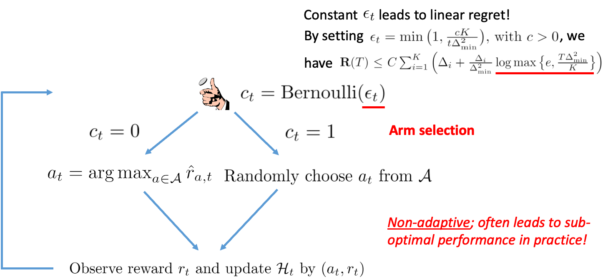
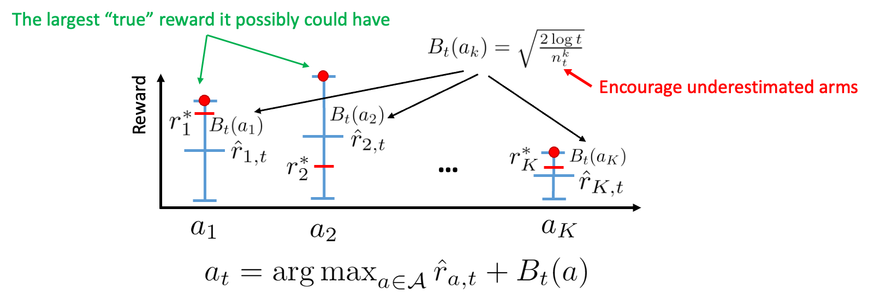

+++
date = '2025-11-03T21:11:10+08:00'
draft = false
title = 'RL Note 2: Multi-Armed Bandits'
tags = ['Course Notes', 'Reinforcement Learning']
categories = ['Learning']
+++

# Prologue
In the [last post](../r1/index.md), we introduced the basics of RL—action, reward, state, value, policy, model, etc.—so you should now have a rough picture of the field. In this post, we go deeper and discuss a classic yet still active topic: Multi-Armed Bandits (MAB). There will be more math ahead; hope you can enjoy it.

# Problem Formulation 
Multi-armed bandits are popular gambling games. There are slot machines, each called a bandit, with an unknown reward distribution that governs how much you get when pulling its arm. Your goal is to maximize the total winnings within a fixed number of pulls. You may try the game to get an intuition at https://su-my.github.io/Test-page.


Let's abstract the gambling game to a formal problem definition:
```callout {title="Definition: Stochastic Multi-Armed Bandit(MAB) Problem"}
Let $\mathcal{A} = \{ a_1, a_2, \dots, a_K \}$ be the set of arms. Pulling arm $a_k$ at round $t$ yields a reward $R_{t,k} \sim \mathcal{D}_k$, where each $\mathcal{D}_k$ is an unknown distribution with mean $\mu_k$. Over a finite horizon $T$, a policy chooses arms $(a_{i_1}, \dots, a_{i_T})$ and observes rewards $(R_{1,i_1}, \dots, R_{T,i_T})$. The objective is to maximize the expected cumulative reward $\mathbb{E}_\pi\left[\sum_{t=1}^{T} R_{t,i_t}\right]$.
```
where the $R_i$ notations are random variabes for rewards.

Furthur discussions:

## Regret
### Definitions
Regret is the primary metric for evaluating a MAB algorithm. Informally, it is the gap between the reward you would obtain by always pulling the best arm and the reward actually obtained by the algorithm. <span id='sub-linear-regret'>A smaller regret indicates a better algorithm.</span>

Throughout this section we assume a stochastic environment with arm-wise reward means $\{\mu_k\}_{k=1}^K$, and we write $\mu^* = \max\limits_{1\le k\le K} \mu_k$ for the optimal mean.

```callout {title="Definition: Realized Pseudo-Regret"}
Fix a policy $\pi$ and a sample path $\omega=(a_{i_1}, a_{i_2},\dots,a_{i_T})\in\Omega$.  
Let $A_t:\Omega\to\mathcal{A}$ denote the random arm chosen at round $t$, and write $A_t(\omega)=a_{i_t}$ for its realization along $\omega$.  
The realized pseudo-regret at horizon $T$ is
$$
\mathbf R_\pi(T,\omega)
= \sum_{t=1}^T \bigl(\mu^* - \mu(A_t(\omega))\bigr)
= T\mu^* - \sum_{t=1}^T \mu_{i_t}.
$$
```

```callout {title="Definition: Random Pseudo-Regret"}
Under policy $\pi$, the (trajectory-dependent) random pseudo-regret is the random variable
$$
\mathbf R_\pi(T)
= \sum_{t=1}^T \bigl(\mu^* - \mu(A_t)\bigr) = T\mu^* -\sum_{t=1}^T\mu(A_t),
$$
It represents the regret as a random variable before taking expectation.
```

```callout {title="Definition: Expected Pseudo-Regret"}
The expected pseudo-regret of policy $\pi$ is
$$
R_{\pi}(T) = \mathbb{E}_\pi[\mathbf R_\pi(T)]
= \int_\Omega \mathbf R_\pi(T,\omega)\,d\mathbb{P}_\pi(\omega),
$$
which measures the algorithm’s average performance under its induced randomness.
```

The three regret notions above may look verbose, but they separate measurables cleanly and avoid mixing pathwise quantities with expectations[^1]. Two remarks:

1) Why **pseudo**-regret?  
Pseudo‑regret replaces realized rewards by their means. It isolates the algorithm’s decision quality from observation noise. A corresponding “real” (pathwise) regret can be defined by using realized rewards. Let $a^*\in\arg\max_k \mu_k$ and let $r_t(a)$ denote the realized reward at round $t$ if arm $a$ were pulled. Then the realized regret along $\omega$ is
$$
\mathbf R^{\mathrm{real}}_\pi(T,\omega)
= \sum_{t=1}^T \bigl(r_t(a^*) - r_t(A_t(\omega))\bigr).
$$
Taking expectation over the reward noise (with $r_t(a)\sim\mathcal D_a$) recovers the pseudo‑regret:
$$
\mathbb E\bigl[\mathbf R^{\mathrm{real}}_\pi(T,\omega)\mid A_1(\omega),\dots,A_T(\omega)\bigr]
= \mathbf R_\pi(T,\omega).
$$
In analysis we usually work with pseudo‑regret, and when context is clear we simply say “regret”.

2) Why is $A_t$ random?  
Because both the rewards and the policy may be stochastic. Rewards influence the history observed by the policy, and the policy may randomize given that history; therefore $A_t:\Omega\to\mathcal A$ is a random variable.

[^1]: Many expositions (e.g., [Introduction to Multi-Armed Bandits](https://arxiv.org/pdf/1904.07272), pp. 5–6) present regret directly under expectation and sometimes blur the distinction between pathwise and expected quantities. The split into realized, random, and expected pseudo‑regret avoids that ambiguity.

### Lower Bounds
> For convenience, we only talk about the realized regret under a fixed trajectory $\omega$ and a fixed policy $\pi$ and simplify the $\mathbf {R}_\pi(T,\omega)$ as $\mathbf R(T)$.

As mentioned [before](#sub-linear-regret), we should make the regret grow slower. So what is the lower bound for regret?

It's easy to find out any algorithm cannot be worse than linear, since:

<span id='linear-lower-bound'>
$$
\begin{aligned}
\mathbf R(T) &= \sum_{t=1}^T\left(\mu^*-\mu(A_t(\omega))\right) \\
& \leq \sum_{t=1}^T\left(\mu^*-\mu'\right) \\
& = T\Delta \\
&= \Omega(T)
\end{aligned}
$$
where $\mu' = \min\limits_{1\le k\le K} \mu_k, \Delta = \mu^*-\mu'$.
</span>

Hence, a wise algorithm should be sub-linear, i.e. $o(T)$.
Two common lower bounds are:
- Gap-independent: $$\Omega(\sqrt{TK})$$
- <div id='gap-dependent-lower-bound'>Gap-dependent: $$\Omega\left(\sum_{a_i \ne a^*} \left( \frac{\Delta_i}{KL(P_{a_i}, P_{a^*})} \right) \log T\right)$$</div>

where $K$ is the number of arms; $\Delta_i$ is the gap between the mean of $a_*$ and $a_i$; the gap-independent means it's hard to identify the gap between the arms; gap-dependent is the opposite.

Intuitively, the easier the gap is to indentify, the less attention will be paid to find out the best arm and we will get lower regret. That's why the gap-dependent lower bound is $\Omega(\log T)$ which is less than $\Omega(\sqrt{T})$

> Proofs will be provided once I figured them out.

## Explore-Exploit Dilemma 
The difficulty of MAB comes from the **explore-exploit dilemma**, which is intuitive once you get to know what MAB problems are chasing for.
- Explore: we must pay some steps to explore the best policy for choosing among arms to avoid commiting to the wrong arms causing linear regrets later. But the exploration phase is always along with regret accumulation itself because of the wrong attempts we must meet.
- Exploit: Stick to current policy. As talked before, this may leads to high regret if the exploration is not sufficient.

## MAB From the Perspective of RL
As the broad picture you may have for MAB now, it's just a RL-like problem with simplified environments. You may treat the reward in MAB as a combination of **observation** and **reward** in RL.


# Tail Bounds[^2]
[^2]: This section mainly refers to the [ITCS](https://itcs.finite-dimensional.space/#concentration-and-tail-bounds) course taught by Prof. [Zhengfeng Ji](https://www.cs.tsinghua.edu.cn/csen/info/1312/4388.htm).

To get into the real discussion of MAB, we first state a few mathematical propositions that describe how far samples of a random variable can deviate from its expectation. This is necessary for further analysis of MAB algorithms since we are estimating the means $\mu_k$; if we can estimate these means accurately and quickly, we can obtain low regret. 
> If you are not interested in the math details, you can jump to [Hoeffding's Inequality](#hoeffdings-inequality) and skip this section omitting all proofs.

## Markov's Inequality
```callout {title="Proposition: Markov's Inequality"}
$$
\Pr(X\ge a)\le \frac{\mathbb E(X)}{a}
$$
where $X$ is a **non-negative** random variable.
```

```callout {.neutral title="Proof: Markov's Inequality" collapsible="true" collapsed="true"}
Consider the indicator function for $X\ge a$:
$$
\mathbf 1_{\{X\ge a\}} = \begin{cases}
1 & X\ge a \\
0 & X < a
\end{cases}
$$
By the definition of expectation, $\mathbb E\bigl[\mathbf 1_{\{X\ge a\}}\bigr] = \Pr(X\ge a)$.

If $X < a$, then $\mathbf 1_{\{X\ge a\}}=0$ and $X\ge 0 = a\,\mathbf 1_{\{X\ge a\}}$; if $X\ge a$, then $\mathbf 1_{\{X\ge a\}}=1$ and $X\ge a = a\,\mathbf 1_{\{X\ge a\}}$. Thus $X\ge a\,\mathbf 1_{\{X\ge a\}}$ always holds.

Taking expectations on both sides yields
$$
\mathbb E(X)\ge a\,\mathbb E\bigl[\mathbf 1_{\{X\ge a\}}\bigr]
= a\,\Pr(X\ge a),
$$
i.e.
$$
\Pr(X\ge a)\le \frac{\mathbb E(X)}{a}.
$$
$\square$

```
## Chebyshev's Inequality
```callout {title="Proposition: Chebyshev's Inequality"}
$$
\Pr(\lvert X-\mu\rvert\ge k\sigma)\le\frac{1}{k^2},\quad \text{for any } k>0,
$$
where $\mu$ is the expectation of $X$, and $\sigma$ is the standard deviation of $X$.
```

```callout {.neutral title="Proof: Chebyshev's Inequality" collapsible="true" collapsed="true"}
Using Markov's inequality, we have:

$$
\begin{aligned}
\Pr(\lvert X-\mu\rvert\ge k\sigma) & = \Pr(\lvert X-\mu\rvert^2\ge k^2\sigma^2)\\
& \le\frac{\mathbb E\bigl[(X-\mu)^2\bigr]}{k^2\sigma^2} \\
& = \frac{1}{k^2},
\end{aligned}
$$
where the last equality uses $\operatorname{Var}(X)=\mathbb E\bigl[(X-\mu)^2\bigr]=\sigma^2$. $\square$
```

## Chernoff Bound
The Chernoff bound is a technique to estimate tail bounds quantitatively, i.e., $\Pr(X\ge a)$ or $\Pr(X\le a)$. We can summarize it in three steps:
```callout {title="Chernoff Bound Trick Steps"}
1. For $t\in\mathbb R$, apply the map $x\mapsto e^{tx}$ to obtain $\Pr(e^{tX}\ge e^{ta})$. When $t>0$ this bounds the upper tail $\Pr(X\ge a)$; when $t<0$ it bounds the lower tail $\Pr(X\le a)$. This ensures the random variable $e^{tX}$ is non‑negative so Markov’s inequality applies.
2. Apply Markov’s inequality:
$$\Pr(e^{tX}\ge e^{ta})\le e^{-ta}\,\mathbb E\bigl[e^{tX}\bigr].$$
3. Choose $t$ to make the right‑hand side as small as possible (optimize over $t$): $$\Pr(X\ge a)\le \inf\limits_{t>0} e^{-ta} M_X(t),\quad \Pr(X\le a)\le \inf\limits_{t<0} e^{-ta} M_X(t),$$
where $M_X(t)=\mathbb E\bigl[e^{tX}\bigr]$ is the moment generating function (MGF) of $X$.
```
As an illustration, consider Bernoulli trials and apply the Chernoff bound.

Suppose we have $n$ i.i.d. Bernoulli trials $X_i$ with success probability $p$. Let $X=\sum_i X_i$; then $\mu = \mathbb E[X]=np$. Suppose $\lambda > 1$.

$$
\begin{aligned}
\Pr(X\ge \lambda\mu)&\le \inf\limits_{t>0} e^{-t\lambda np}\,\mathbb E\bigl[e^{tX}\bigr]\\
&=\inf\limits_{t>0} e^{-t\lambda np}\, \prod_{i=1}^n \mathbb E\bigl[e^{tX_i}\bigr]\\
&=\inf\limits_{t>0} e^{-t\lambda np}\, (pe^t+1-p)^n \\
&=\inf\limits_{t>0} \exp\bigl(n\log (pe^t+1-p)-t\lambda np\bigr)
\end{aligned}
$$

Consider the function $f(t) = n\log (pe^t+1-p)-t\lambda np$. Taking the derivative and setting it to $0$, we have 
$$f'(t) = \frac{npe^t}{pe^t+1-p}-\lambda np = 0$$
i.e., $$t^*=\log \lambda+\log(1-p)-\log(1-\lambda p).$$
It is easy to verify that $f(t)$ attains its minimum at $t^*$. Substituting $t^*$ into $f(t)$, we have
$$
f(t^*) = -n\left((1-\lambda p)\log \frac{1-\lambda p}{1-p}+\lambda p \log \lambda\right) = -n\,D_{\text{KL}}(\lambda p \parallel p),
$$
where $D_{\text{KL}}(q\parallel p)= q\log\!\frac{q}{p} + (1-q)\log\!\frac{1-q}{1-p}$ is the Kullback–Leibler divergence between Bernoulli parameters.

$t^* > 0$ since $\lambda > 1$. Hence, we have
$$
\Pr(X\ge \lambda\mu)\le \exp\bigl(-n\,D_{\text{KL}}(\lambda p \parallel p)\bigr).
$$

## Hoeffding's Inequality
> The protagonist finally comes!
The Hoeffding's inequality are bounding a set of independent bounded random variables. You may find it especially useful in MAB problems since the arms are basically a set of independent random variables.

Hoeffding's Inequality is actually a special case of Chernoff Bound. Let's give the proposition first:
```callout {title="Proposition: Hoeffding's Inequality"}
Given a set of independent bounded random varibales $\left\{X_i\right\}_{i=1}^n$ with $X_i\in[a_i,b_i]$. Let $X=\sum_i X_i$ and $\mu=\mathbb E[X]$. Then
$$
\Pr(X-\mu\ge \varepsilon)\le \exp\left(-\frac{2\varepsilon^2}{\sum_{i=1}^n (b_i-a_i)^2}\right)
$$
or 
$$
\Pr(X-\mu\le -\varepsilon)\le \exp\left(-\frac{2\varepsilon^2}{\sum_{i=1}^n (b_i-a_i)^2}\right)
$$
```

It's easy to find out the Hoeffding's inequality is a special case of Chernoff Bound.
```callout {.neutral title="Proof: Hoeffding's Inequality" collapsible="true" collapsed="true"}
Let $\mu_i = \mathbb E[X_i]$, $\varepsilon > 0$. Then
$$
\begin{aligned}
\Pr(X-\mu\ge \varepsilon)&\le \inf\limits_{t>0} e^{-t\varepsilon}\,\mathbb E\left[e^{t(X-\mu)}\right]\\
&=\inf\limits_{t>0} e^{-t\varepsilon}\, \mathbb E\left[e^{t\sum_{i=1}^n(X_i-\mu_i)}\right]\\
&=\inf\limits_{t>0} e^{-t\varepsilon}\, \prod_{i=1}^n \mathbb E\left[e^{t(X_i-\mu_i)}\right]
\end{aligned}
$$
According to Hoeffding's Lemma, we have 
$$
\mathbb E\left[e^{t(X_i-\mu_i)}\right]\le \exp\left(\frac{t^2(b_i-a_i)^2}{8}\right)
$$
Hence
$$
\begin{aligned}
\Pr(X-\mu\ge \varepsilon)&\le \inf\limits_{t>0} e^{-t\varepsilon}\, \prod_{i=1}^n \exp\left(\frac{t^2(b_i-a_i)^2}{8}\right)\\
&=\inf\limits_{t>0} \exp\left(-t\varepsilon+\frac{t^2}{8}\sum_{i=1}^n (b_i-a_i)^2\right) \\
&=\exp\left(-\frac{\varepsilon^2}{2\sum_{i=1}^n (b_i-a_i)^2}\right)
\end{aligned}
$$
The last equality is taken when $t=\frac{4\varepsilon}{\sum_{i=1}^n (b_i-a_i)^2}$
$\square$
```
We used Hoeffding's Lemma to bound the MGF of $X_i-\mu_i$:
```callout {title="Hoeffding's Lemma"}
Let $X\in[a,b]$ and $\mu=\mathbb E[X]$. Then $\forall t \in \mathbb R$
$$
\mathbb E\left[e^{t(X-\mu)}\right]\le \exp\left(\frac{t^2(b-a)^2}{8}\right)
$$
```

```callout {.neutral title="Proof: Hoeffding's Lemma" collapsible="true" collapsed="true"}
Consider Y = $X-\mu$, then $\mathbb E[Y] = 0$
Since $e^{tY}$ is convex, we have:
$$
e^{tY} = \frac{b-Y}{b-a}e^{ta} + \frac{Y-a}{b-a}e^{tb}
$$
Take expectation on both sides, we have
$$
\mathbb E\left[e^{tY}\right] = \frac{b}{b-a}e^{ta} - \frac{a}{b-a}e^{tb}
$$
Let $u=t(b-a)$ and $\lambda = \frac{-a}{b-a}$, then
$$
\mathbb E\left[e^{tY}\right] = e^{-\lambda u} \left(1-\lambda + \lambda e^{u}\right) = \exp\left(-\lambda u + \log \left(1-\lambda+\lambda e^{u}\right)\right)
$$
Consider $g(u)=-\lambda u + \log \left(1-\lambda+\lambda e^{u}\right)$, it's easy to verify $g(0) = g'(0) = 0$.

And $g''(u) = \frac{(1-\lambda)\lambda e^u}{(1-\lambda+\lambda e^{u})^2}\le\frac{1}{4}$
R_{\operatorname{ETC}(m)} (n) \le m\sum_{i=2}^k\Delta_i + (n-mk)\sum_{i=2}^k\exp\left(-\frac{m\Delta_i^2}{4}\right)

Hence $\exist \xi\in(0,u)$ s.t. $g(u) = g(0) + g'(0)u + \frac{1}{2}g''(\xi)u^2 \le \frac{u^2}{8}$

Which means $\mathbb E\left[e^{tY}\right]\le \exp\left(\frac{u^2}{8}\right)$

$\square$
```


Let's also give a special case of Hoeffding's Inequality here when all random variables are i.i.d. and sub-gaussian.

<div id='hoeffding-ineq-iid-subgaussian'>

```callout {title="Hoeffding's Inequality for i.i.d. sub-gaussian random variables"}
Let $X_1,\ldots,X_n$ be i.i.d. sub-gaussian random variables with sub-gaussian norm $\sigma$, which means
$$
\mathbb E\left[e^{t(X_i-\mu)}\right]\le \exp\left(\frac{t^2\sigma^2}{2}\right)
$$
Let $\bar X=\frac{1}{n}\sum_{i=1}^n X_i$ and $\mu=\mathbb E[\bar X]$. Then
$$
\Pr(\lvert\bar X-\mu\rvert\ge \varepsilon)\le 2\exp\left(-\frac{n\varepsilon^2}{2\sigma^2}\right)
$$
```

</div>

```callout {.neutral title="Proof: Hoeffding's Inequality for i.i.d. sub-gaussian random variables" collapsible="true" collapsed="true"}
The both sides are symmetric. Let's prove the case $\Pr(\bar X-\mu\ge \varepsilon)$.

It's easy to verify that $\bar X $ is also sub-gaussian with sub-gaussian norm $\frac{\sigma}{\sqrt{n}}$ and .
$$
\begin{aligned}
\Pr(\bar X -\mu\ge\varepsilon) &= \Pr(e^{t(\bar X-\mu)}\ge e^{t\varepsilon}) \\
& = \inf\limits_{t>0} e^{-t\varepsilon}\,\mathbb E\left[e^{t(\bar X-\mu)}\right] \\
& \le \inf\limits_{t>0} \exp\left(-t\varepsilon + \frac{t^2\sigma^2}{2n}\right) \\
& = \exp\left(-\frac{n\varepsilon^2}{2\sigma^2}\right)
\end{aligned}
$$
```


# Explore-Then-Commit
Explore-Then-Commit (ETC) is an intuitive algorithm for MAB problems. It pulls each arm a fixed number of times, then commits to the arm with the highest estimated mean.

```callout {title="Definition: Explore-Then-Commit Algorithm"}
Given the following environment:
- $k$: number of arms
- $n$: horizon, $n > k$
- $\mathcal A = \{a_i\}_{i=1}^{k}$

The arm chosen at round $t$ is:
$$
A_t = \begin{cases}
(t\mod k) + 1 & t\le mk \\
\argmax_{a\in\mathcal A} \hat \mu_a & t > mk
\end{cases}
$$
where $m<\lfloor\frac{n}{k}\rfloor$ is the number of times each arm is pulled and $\hat \mu_a=\frac{1}{m}\sum_{i=1}^m r_{a,i}$, with $r_{a,i}$ the reward of arm $a$ on its $i$-th pull. Tie-breaking of $\argmax$ is usually random.
```

Consider the special case where all arms are $1$-sub-Gaussian; this helps build intuition for the regret. For brevity, we denote the expected pseudo-regret of ETC at horizon $n$ by $R_{\mathrm{ETC}}(n)$.

W.l.o.g., assume $\forall i < j, \mu_i \ge \mu_j$, and define $\Delta_i = \mu_1 - \mu_i$.

$$
\begin{aligned}
R_{\operatorname{ETC}(m)} (n) & = \mathbb E\left[\sum\limits_{i=1}^n \Delta_{A_i}\right] \\
& = \sum\limits_{i=1}^n \sum_{j=1}^k\Pr(A_i=j)\Delta_j \\
& = m\sum_{i=2}^k\Delta_i + (n-mk)\sum_{i=2}^k\Pr(A_{mk+1}=i)\Delta_i
\end{aligned}
$$

Moreover,
$$
\begin{aligned}
\Pr(A_{mk+1}=i) & \le \Pr(\hat \mu_{i} \ge \max_{a\in\mathcal A, a\ne i}\mu_a) \\
& \le \Pr(\hat \mu_{i} \ge \mu_1) \\
& = \Pr((\hat\mu_{i}-\hat\mu_1) - (\mu_i-\mu_1)\ge \Delta_i) \\
& \le \exp\left(\frac{-m\Delta_i^2}{4}\right)
\end{aligned}
$$

The first inequality is strict when multiple arms tie, because the tie-breaking rule is random. The last inequality follows since $X-Y$ is $\sqrt{2}$-sub-Gaussian when $X$ and $Y$ are $1$-sub-Gaussian, and then we can apply the [Hoeffding's Inequality](#hoeffding-ineq-iid-subgaussian).

Hence, we have
$$
R_{\operatorname{ETC}(m)} (n) \le m\sum_{i=2}^k\Delta_i + (n-mk)\sum_{i=2}^k\Delta_i\exp\left(-\frac{m\Delta_i^2}{4}\right)
$$
When $k=2$ and writing $\Delta = \Delta_2$, we have
$$
R_{\operatorname{ETC}(m)} (n) \le m\Delta + (n-mk)\Delta\exp\left(-\frac{m\Delta^2}{4}\right)\le m\Delta + n\Delta\exp\left(-\frac{m\Delta^2}{4}\right)
$$
Differentiating the RHS with respect to $m$ shows it is minimized at $$m=\max\left(1,\left\lceil\frac{4}{\Delta^2}\log\left(\frac{n\Delta^2}{4}\right)\right\rceil\right),$$
which implies

<div id='etc-lower-bound'>
$$
\boxed{
R_{\operatorname{ETC}(m)} (n) \le \min \left( n\Delta, \Delta + \frac{4}{\Delta} \left( 1 + \max \left( 0, \log \left( \frac{n\Delta^2}{4} \right) \right) \right) \right)
}
$$
</div>

Note that $m \ge 1$, and $R_{\operatorname{ETC}(m)} (n)$ cannot exceed $n\Delta$ as discussed [above](#linear-lower-bound). Informally, this bound says that, for fixed gap $\Delta$, the regret of ETC grows only logarithmically with the horizon $n$, but with a relatively large constant and the need to know (or tune around) $\Delta$ to choose $m$.

We can plot how $R_{\operatorname{ETC}} (n)$ changes with $\Delta$ using a short Python snippet:

````callout {.neutral title="Python Code: ETC Regret Upper Bound" collapsible="true" collapsed="true"}
```python
import numpy as np
import matplotlib.pyplot as plt

n = 1000
eps = 1e-6
deltas = np.linspace(eps, 100.0, 1000)

term_linear = n * deltas
term_log = deltas + (4 / deltas) * (1 + np.maximum(0, np.log(n * deltas**2 / 4)))
bound = np.minimum(term_linear, term_log)

plt.figure(figsize=(6, 4))
plt.plot(deltas, bound, label=r"$R_{\mathrm{ETC}}(n)$ upper bound")
plt.xlabel(r"$\Delta$")
plt.ylabel(r"regret bound")
plt.title(f"ETC regret bound vs Δ (n={n})")
plt.grid(True, ls="--", alpha=0.5)
plt.legend()
plt.tight_layout()
plt.show()
```
````



The regret bound diverges as $\Delta \to \infty$. If we restrict to $\Delta \le 1$ (arms are $1$-sub-Gaussian), the bound is maximized near $\Delta \approx \frac{2\sqrt{e}}{\sqrt{n}}$, where $R_{\operatorname{ETC}} (n) \approx \frac{4\sqrt{n}}{\sqrt{e}}$ (from differentiating the RHS with respect to $m$). For fixed $\Delta$, the gap-dependent upper bound scales as $O((\log n)/\Delta)$, but unlike UCB it needs a good estimate of $\Delta$ (to choose $m$) and carries larger constants.


## Varaints of ETC
ETC is intuitive but too simple, which leads to the folloing disadvatages:
1. It requires the prior of $\Delta$ to find the best $m$ for exploration, which are usually unknown in real scenerios.
2. It is too rigid. It may continually commit to the wrong arms in the exploration phase.
3. Theorectically, it is usually two times of the gap-dependent lower bound.

```callout{title="Proposition: Lower Bound of ETC"}

[The lower bound of ETC](#etc-lower-bound) is no less than two times of the [gap-dependent lower bound](#gap-dependent-lower-bound).

```

```callout {.neutral title="Proof: Lower Bound of ETC" collapsible="true" collapsed="true"}
We only prove a special case with two arms $a_1$ and $a_2$ with Gaussian distribution $\sigma_1$.
Consider the [gap-dependent lower bound](#gap-dependent-lower-bound):
$$
L_{\text{gap-dependent}} (n) \ge \frac{\Delta\log n}{\operatorname{KL}(P_{a_1}, P_{a_2})}
$$
And
$$
\begin{aligned}
\operatorname{KL}\left(\mathcal N(\mu_1, 1), \mathcal N(\mu_2, 1)\right) &=
\mathbb E_{x\sim P_{a_1}}\left[\log\left(\frac{P_{a_1}(x)}{P_{a_2}(x)}\right)\right] \\
&=\mathbb E_{x\sim P_{a_1}}\left[\log\left(\frac{\frac{1}{\sqrt{2\pi}}\exp\left(-\frac{(x-\mu_1)^2}{2}\right)}{\frac{1}{\sqrt{2\pi}}\exp\left(-\frac{(x-\mu_2)^2}{2}\right)}\right)\right] \\
&=\left(\mu_1-\mu_2\right)\mathbb E_{x\sim P_{a_1}}\left[x-\frac{\mu_1+\mu_2}{2}\right] \\
& = \frac{\left(\mu_1-\mu_2\right)^2}{2} \\
& = \frac{\Delta^2}{2}
\end{aligned}
$$
Hence,
$$
L_{\text{gap-dependent}} (n) = \frac{2}{\Delta} \log n
$$
But the [The lower bound of ETC](#etc-lower-bound) is
$$
L_{\text{ETC}} = \Omega\left(\frac{4}{\Delta}\log n\right)
$$
with a multiplicative constant of $2$.

$\square$
```

Hence, there are two common variants of ETC to address the above disadvantages:
### Epoch Greedy ETC
Rather than committing to the arm with the highest estimated mean, Epoch Greedy ETC commits to the arm with the highest estimated mean in each epoch.

### $\varepsilon$-Greedy ETC
Toss a coin with probability $\varepsilon$ to commit to the arm with the highest estimated mean, otherwise commit to a random arm.

# Upper Confidence Bound (UCB)
UCB is a classical algorithm for MAB problems. It follows the **optimism‑in‑the‑face‑of‑uncertainty** principle: arms with larger statistical uncertainty receive a positive bonus, so rarely sampled arms are explored more. 


Throughout this subsection we write $R_{\mathrm{UCB}}(n)$ for the expected pseudo-regret of the UCB algorithm at horizon $n$.

```callout{title="Definition: Upper Confidence Bound Algorithm"}
Given the environment below
- $k$: number of arms
- $n$: horizon, $n > k$
- $\mathcal A = \{a_i\}_{i=1}^{k}$

Let $\hat \mu_a$ be the empirical mean of arm $a$ after $N_t(a)$ pulls by round $t$. The arm chosen at round $t$ is
$$
A_t = \argmax_{a\in\mathcal A} \bigl(\hat \mu_a + B_t(a)\bigr),
\qquad
B_t(a) = \sqrt{\frac{\alpha\log t}{N_t(a)}},
$$
where $\alpha>0$ is a hyperparameter (commonly $\alpha=2$).
```
The bonus $B_t(a)$ shrinks as $N_t(a)$ grows and increases slowly with $t$, encouraging exploration of under‑sampled arms.

The form of $B_t(a)$ comes directly from [Hoeffding's Inequality](#hoeffding-ineq-iid-subgaussian).
```callout{.neutral title="Derivation of $B_t(a)$"}
Let arm $a$ have $\sigma$‑sub-Gaussian rewards. Hoeffding gives
$$
\Pr\bigl(\hat \mu_a - \mu_a \ge \varepsilon\bigr) \le \exp\!\left(-\frac{N_t(a)\varepsilon^2}{2\sigma^2}\right).
$$
To make this error probability decay at most on the order of $t^{-\beta}$ for some $\beta>0$, it suffices that
$$
\exp\!\left(-\frac{N_t(a)\varepsilon^2}{2\sigma^2}\right) \le t^{-\beta}.
$$
Solving for $\varepsilon$ suggests choosing
$$
\varepsilon = \sqrt{\frac{\alpha\log t}{N_t(a)}}, \qquad \alpha = 2\sigma^2\beta.
$$
```

Next we sketch the regret of UCB. Assume all arms are $\tfrac{1}{2}$‑sub-Gaussian, and $\beta = 4$, hence $\alpha = 2$. Order the arms so that $\mu_1 \ge \mu_2 \ge \cdots \ge \mu_k$ and define the gaps $\Delta_i = \mu_1 - \mu_i$ for $i\ge2$.

For each round $t$, define the good event
$$
G_t = \left\{\forall i\in[1,k],\; \bigl|\hat \mu_i - \mu_i\bigr| \le B_t(i)\right\}.
$$
By Hoeffding’s inequality and a union bound over arms, one can choose the constant in $B_t(i)$ (equivalently, in $\beta$) so that
$$
\Pr(\neg G_t) = O\!\left(\frac{1}{t^4}\right).
$$
We decompose the regret horizon‑wise:
$$
R_{\operatorname{UCB}}(n)
= \sum_{t=1}^n \mathbb E[\Delta_{A_t}]
= \sum_{t=1}^n \mathbb E[\Delta_{A_t}\mathbf 1_{G_t}] + \sum_{t=1}^n \mathbb E[\Delta_{A_t}\mathbf 1_{\neg G_t}].
$$
Since the instantaneous regret is at most $\Delta_{\max}\coloneqq\max_{i\ge2}\Delta_i$, the second sum is bounded by
$$
\sum_{t=1}^n \mathbb E[\Delta_{A_t}\mathbf 1_{\neg G_t}]
\le \Delta_{\max}\sum_{t=1}^n \Pr(\neg G_t)
\le \Delta_{\max}\sum_{t=1}^\infty O\!\left(\frac{1}{t^4}\right)
= O(1),
$$
so the contribution from the “bad” events $\neg G_t$ is a constant independent of $n$.

On the good events $G_t$, regret depends on how often suboptimal arms are pulled. Let $N_n(a_i)$ be the number of pulls of arm $a_i$ up to round $n$. Expanding $\Delta_{A_t}$ over arms gives
$$
\Delta_{A_t} = \sum_{i=2}^k \Delta_i\,\mathbf 1\{A_t = a_i\},
$$
so
$$
R_{\operatorname{UCB}}(n)
= \sum_{t=1}^n \mathbb E[\Delta_{A_t}\mathbf 1_{G_t}] + O(1) \\
= \sum_{t=1}^n \sum_{i=2}^k \Delta_i\,\mathbb E\bigl[\mathbf 1\{A_t = a_i\}\mathbf 1_{G_t}\bigr] + O(1) \\
= \sum_{i=2}^k \Delta_i\,\mathbb E\Bigl[\sum_{t=1}^n \mathbf 1\{A_t = a_i\}\mathbf 1_{G_t}\Bigr] + O(1) \\
\le \sum_{i=2}^k \Delta_i\,\mathbb E\Bigl[\sum_{t=1}^n \mathbf 1\{A_t = a_i\}\Bigr] + O(1)
= \sum_{i=2}^k \Delta_i\,\mathbb E\bigl[N_n(a_i)\bigr] + O(1).
$$
Whenever a suboptimal arm $a_i$ is chosen at round $t$ and $G_t$ holds, the selection rule implies
$$
\hat\mu_{a_i} + B_t(a_i) \ge \hat\mu_{a_1} + B_t(a_1),
$$
which together with $\bigl|\hat\mu_{a_i} - \mu_i\bigr|\le B_t(a_i)$ and $\bigl|\hat\mu_{a_1} - \mu_1\bigr|\le B_t(a_1)$ yields
$$
\mu_i + 2B_t(a_i) \ge \mu_1
\quad\Longrightarrow\quad
B_t(a_i) \ge \frac{\Delta_i}{2}.
$$
Recalling that with $\alpha=2$ we have $B_t(a_i) = \sqrt{\tfrac{2\log t}{N_t(a_i)}}$, this implies
$$
\sqrt{\frac{2\log t}{N_t(a_i)}} \ge \frac{\Delta_i}{2}
\quad\Longrightarrow\quad
N_t(a_i) \le \frac{8\log t}{\Delta_i^2},
$$
and hence in particular
$$ 
N_n(a_i) \le \frac{8\log n}{\Delta_i^2}.
$$
Plugging this back into the regret expression and combining with the constant contribution from bad events, we obtain
$$
R_{\operatorname{UCB}}(n)
= O\!\left(\sum_{i=2}^k \frac{\log n}{\Delta_i}\right).
$$
In particular, if we let $\Delta = \min_{i\ge2}\Delta_i$ and denote the UCB regret at horizon $n$ by $R_{\mathrm{UCB}}(n)$, then
$$
R_{\mathrm{UCB}}(n) = O\!\left(\frac{\log n}{\Delta}\right).
$$
Putting this together with the ETC analysis above, both $R_{\mathrm{ETC}}(n)$ and $R_{\mathrm{UCB}}(n)$ achieve a gap‑dependent logarithmic rate $O((\log n)/\Delta)$, but ETC needs a **well‑tuned exploration length $m$** (which in turn depends on the unknown gap), whereas UCB attains the same order of regret **without any prior knowledge of $\Delta$ by adapting its exploration bonus online.**

