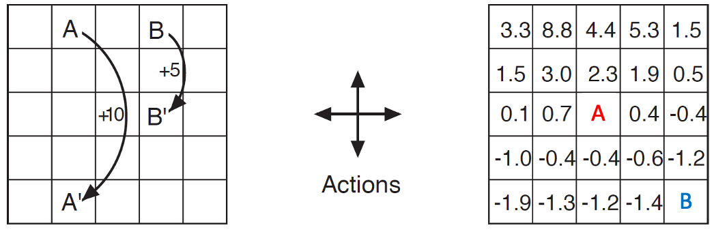

+++
date = '2026-03-26T21:58:38+08:00'
draft = false
title = 'RL Note 3: Markov Decision Process'
tags = ['Course Notes', 'Reinforcement Learning']
categories = ['Learning']
+++

# Prologue
It's almost been half a year since I first decided to kick off this *RL notes* series. I apologize for the delay -- I've been busy with other work, or honestly, just lacking persistence :( Also I have to say I struggled a bit to write [my last post](../r2/index.md) on the topic of MAB since the math is quite tough :(

Anyway, let's continue the journey of RL with the well-known MDP -- Markov Decision Process.

# Introduction
Let's first revisit [the concept of state in the first post](../r1/index.md/#definition-state):

```callout {.info title="Recall: Definition of State"}
A function of the **history**.
$$
s_t = f(o_0, a_0, r_1, o_1, a_1, r_2, \ldots, o_t)
$$
```

If we represent $h_t = (o_0, a_0, r_1, \ldots, o_t)$, then

<span id="state-expansion">
$$
s_t = f\left(h_t\right) = f\left(h_{t-1},a_{t-1},r_t,o_t\right)
$$
</span>

As shown, we expand the history $h_t$ recursively as the argument of the definition function $f$. How about also defining $s_t$ in the recursive way?

If $s_t$ contains all the useful information in the history $h_t$, we can construct $s_t$ by a new function $g$ without loss of information:
$$
s_t = g\left(s_{t-1},a_{t-1},r_t,o_{t}\right)
$$

For the agent taking action, only the action $a_t$ is determined by itself, and $r_t$ and $o_t$ can all be viewed as part of the environment with randomness, and $o_t$ is often ignored since we merge it into the state $s_t$. This leads to the assumption of the **Markov Property**.

```callout{.info title="Definition: Markov Property"}
Assume that the state $s_t$ contains all the useful information in history $h_t$. Then we have:
$$
\Pr\left(s_{t+1}, r_{t+1} \mid s_t, a_t\right) = \Pr\left(s_{t+1}, r_{t+1} \mid h_t, a_t\right)
$$
```

One example that satisfies the Markov Property is a board game. It's enough to decide the next move once we know the current board. We don't care about how the current state was reached. On the contrary, we cannot predict the direction of a ping-pong ball from a single video frame. We have to know more previous frames, which doesn't satisfy the standard Markov Property. Hence, the Markov Property is actually a simplification of real scenarios, but it still covers many practical scenarios and makes the math much easier and more elegant.

# Markov Decision Process
Perfect! You've got the main idea for an MDP now: given the current state and action, the next state and reward do not depend on the earlier history. The final step in defining MDP is to introduce the environment and decision-making process.

```callout{.info title="Definition: Markov Decision Process"}
The Markov Decision Process can be represented as a 5-tuple where the states satisfy the Markov Property:    
$$
\left(\mathcal S, \mathcal A, P, R, \gamma \right)
$$
s.t.
$$
\Pr\left(s_{t+1},r_{t+1}\mid s_t,a_t\right) = \Pr\left(s_{t+1},r_{t+1}\mid h_t,a_t\right)
$$
- $\mathcal S$: the state space.
- $\mathcal A$: the action space.
- $P$: the transition dynamics, where $P\left(s'\mid s,a\right) = \Pr\left(S_{t+1}=s' \mid S_t = s, A_t = a\right)$ represents the probability of reaching state $s'$ from state $s$ after taking action $a$.
- $R$: the reward function, where $R\left(s,a,s'\right) = \mathbb E\left[R_{t+1} \mid S_t = s, A_t = a, S_{t+1}=s'\right]$ represents the **expected** reward obtained when transitioning from state $s$ to state $s'$ after taking action $a$.
- $\gamma$: the discount factor which belongs to $\left[0,1\right]$.
```
> For the notation $R$, it is kind of confusing whether it is part of the MDP or a random variable standing for reward. For our discussion, $R(s,a,s')$ with brackets corresponds to the former, while $R_k$ with a subscript corresponds to the latter.

The Markov Property is exactly what allows us to define $P(s' \mid s,a)$ and $R(s,a,s')$ using only the current state-action pair, instead of the whole history.

# Bellman Equation
As we talked about [in the first post](../r1/index.md/#the-goal-of-rl-in-value), the goal of RL is to find the states with highest value. So it's crucial to consider the values in the MDP.

A key feature of MDPs is their recursive structure, as shown [above](#state-expansion). Thus, we aim to express the value functions recursively. Before formal discussion, let's define a new notation to simplify the discussion:
```callout{title = "Definition: (Discounted) Return"}
The (discounted) return is a random variable representing the discounted cumulative reward along a trajectory.
$$
G_t = \sum_{k=t+1}^{T}\gamma^{k-t-1} R_{k}
$$
Here $T$ is the terminal time for an episodic task; for a continuing task, we may take $T=\infty$.
```
By [the definitions in the first post](../r1/index.md/#definitions), we have:
$$
Q\left(s_t,a_t\right) = \mathbb E_{\pi}\left[G_t \mid S_t =s_t,A_t=a_t\right]
$$
$$
\begin{aligned}
v\left(s_t\right) &= \mathbb{E}_{a_t\sim\pi\left(\cdot\mid s_t\right)}\left[Q\left(s_t,a_t\right)\right] \\ 
&= \mathbb{E}_{a_t\sim\pi\left(\cdot\mid s_t\right)}\left[\mathbb E_{\pi}\left[G_t\mid S_t=s_t,A_t=a_t\right]\right] \\
&= \mathbb E_{\pi}\left[G_t\mid S_t=s_t\right] \\
&= \mathbb E_{\pi}\left[R_{t+1} + \gamma G_{t+1}\mid S_t=s_t\right] \\
&= \mathbb E_{\pi}\left[R_{t+1} \mid S_t=s_t\right] + \gamma \mathbb E_{\pi}\left[G_{t+1} \mid S_t=s_t\right] \\
\end{aligned}
$$

For the first half, we have:

$$
\begin{aligned}
\mathbb{E}_\pi\left[R_{t+1}\mid S_t=s_t\right] &= \sum\limits_{a_t}\pi\left(a_t\mid s_t\right)\sum_{s_{t+1}}\mathbb E\left[R_{t+1}\mid S_t = s_t, A_t = a_t, S_{t+1} = s_{t+1} \right]\Pr\left(S_{t+1}=s_{t+1}\mid S_t =s_t, A_t =a_t\right) \\
&= \sum\limits_{a_t}\pi\left(a_t\mid s_t\right)\sum_{s_{t+1}}R\left(s_t,a_t,s_{t+1}\right)P\left(s_{t+1}\mid s_t,a_t\right) \\
\end{aligned}
$$

For the second half, we have:

$$
\begin{aligned}
\mathbb E_{\pi}\left[G_{t+1} \mid S_t=s_t\right] &= \mathbb E_\pi\left[\mathbb E_{\pi}\left[G_{t+1}\mid S_{t+1} \right]\mid S_t=s_t\right] \\
& = \mathbb E_\pi\left[v\left(S_{t+1}\right)\mid S_t = s_t\right] \\
& = \sum_{a_{t}}\pi\left(a_t\mid s_t\right)\sum_{s_{t+1}}\Pr\left(S_{t+1} = s_{t+1}\mid S_t =s_t, A_t = a_t\right)v\left(s_{t+1}\right) \\
& = \sum_{a_{t}}\pi\left(a_t\mid s_t\right)\sum_{s_{t+1}}P\left(s_{t+1}\mid s_t,a_t\right)v\left(s_{t+1}\right)
\end{aligned}
$$

Combine the two halves together, we have:

$$
v\left(s_t\right) = \sum_{a_t}\pi\left(a_t\mid s_t\right)\sum_{s_{t+1}}P\left(s_{t+1}\mid s_t,a_t\right)\left[R\left(s_t,a_t,s_{t+1}\right)+\gamma v\left(s_{t+1}\right)\right]
$$

Remove all notations with time subscripts, we have the Bellman Equation.

```callout{.info title = "Definition: Bellman Equation"}
$$
v\left(s\right) = \sum_{a}\pi\left(a\mid s\right)\sum_{s'}P\left(s'\mid s,a\right)\left[R\left(s,a,s'\right)+\gamma v\left(s'\right)\right]
$$
```

Let's take an example of the Bellman Equation to better understand it.
```callout {.neutral title="Example: Bellman Equation"}
Cells with number have given values. The arrows on the left indicate the reward for each move. Hitting a wall yields a reward of $-1$ and the agent remains in the same position. All other moves yield zero rewards. Actions are chosen uniformly at random. $\gamma = 0.9$.

Compute the values for the two highlighted cells on the right. 


It's easy to see the $P(\cdot)$ are one-hot and all $\pi(a\mid s)=0.25$. By the Bellman Equation, we have:
$$
v(A) = 0.25\cdot 0.9\cdot(2.3+0.7-0.4+0.4) = 0.675 \approx 0.7
$$

$$
v(B) = 0.25\cdot 0.9\cdot(-1.2-1.4) + 0.25\cdot 2\cdot (-1+0.9v(B))
$$
Solving it, we have $v(B) \approx -2.0$.
```

# Bellman Equation In a Matrix Form
Let's rewrite the Bellman Equation in a matrix form to make it more unified and elegant. This is feasible in a tabular environment.

Let's define:
$$
r_\pi\left(s\right) = \sum_{a}\pi\left(a\mid s\right)\sum_{s'}P\left(s'\mid s,a\right)R\left(s,a,s'\right)
$$
And suppose $\mathcal S$ and $\mathcal A$ are finite:
$$
\mathcal S = \left\{s_i\right\}_{i=1}^n
$$
$$
\mathcal A = \left\{a_i\right\}_{i=1}^m
$$
Then we can define vectors:
$$
\mathbf v_\pi \in \mathbb R^n,\quad\left(\mathbf v_\pi\right)_i = v_\pi(s_i)
$$
$$
\mathbf r_\pi \in \mathbb R^n,\quad\left(\mathbf r_\pi\right)_i = r_\pi(s_i)
$$
And the transition matrix:
$$
\mathbf P_\pi\in\mathbb R^{n\times n},\quad \left(\mathbf P_\pi\right)_{ij} = \sum_a\pi\left(a\mid s_i\right)P\left(s_j\mid s_i,a\right)
$$
Then we can define the Bellman Equation in a matrix form:
$$
\mathbf v_\pi = \mathbf r_\pi + \gamma\mathbf P_\pi \mathbf v_\pi
$$
Rearranging it, we have:
$$
\left(\mathbf I-\gamma \mathbf P_\pi\right)\mathbf v_\pi = \mathbf r_\pi
$$
To make the solution on the right well-defined, we need to show that $\mathbf I-\gamma \mathbf P_\pi$ is invertible.

```callout {.neutral}
title: Proof: Invertibility of $\mathbf{I}-\gamma\mathbf{P}_{\pi}$
Since $\mathbf P_\pi$ is the probability matrix, we have
$$
\mathbf P_\pi = \left(\mathbf p_1,\mathbf p_2,\ldots,\mathbf p_n\right)^\top
$$
and 
$$
\forall i\in\left[1,n\right], \sum_j \left(\mathbf p_i\right)_j = 1, \left(\mathbf p_i\right)_j \ge 0
$$
Then
$$
\left|\mathbf p_i^\top\mathbf v\right| = \left|\sum_j \left(\mathbf p_i\right)_j\left(\mathbf v\right)_j\right| \le \sum_j \left(\mathbf p_i\right)_j\left|\left(\mathbf v\right)_j\right|\le \max_j\left|\left(\mathbf v\right)_j\right| = \left\|\mathbf v\right\|_\infty
$$
Then 
$$
\left\|\mathbf P_\pi\mathbf v\right\|_\infty = \max_i\left|\mathbf p_i^\top \mathbf v\right| \le \left\|\mathbf v\right\|_\infty
$$
Then
$$
\begin{aligned}
\left\|\left(\mathbf{I}-\gamma\mathbf{P}_{\pi}\right)\mathbf v \right\|_\infty&=\left\|\mathbf v-\gamma\mathbf P_\pi\mathbf v \right\|_\infty \\
&\ge \left\|\mathbf v\right\|_\infty - \gamma\left\|\mathbf P_\pi\mathbf v\right\|_\infty \\
& \ge \left(1-\gamma\right)\left\|\mathbf v\right\|_\infty
\end{aligned}
$$
Then when $\gamma < 1$ and $\mathbf v\ne \mathbf 0$, $\left\|\left(\mathbf{I}-\gamma\mathbf{P}_{\pi}\right)\mathbf v \right\|_\infty>0$ holds, which means $\mathbf{I}-\gamma\mathbf{P}_{\pi}$ is invertible.
```

Hence, when $\gamma<1$, we can express $\mathbf v$ as
$$
\mathbf v_\pi = \left(\mathbf I-\gamma \mathbf P_\pi\right)^{-1}\mathbf r_\pi
$$

# Conclusions
Congratulations! We've covered the most fundamental modeling framework in RL---MDP. In most cases, we will assume that the environment satisfies the MDP assumptions.

It's necessary to clarify that the matrix-form discussion in this section applies to a finite, or tabular, MDP. We assume that both the state space and the action space are finite and discrete, which allows us to represent the problem using linear algebra.

```callout {.tip title="Takeaways"}
- The main idea for Markov Decision Process is to assume the Markov Property:
$$
\Pr\left(s_{t+1}, r_{t+1} \mid s_t, a_t\right) = \Pr\left(s_{t+1}, r_{t+1} \mid h_t, a_t\right)
$$
- Bellman Equation gives a recursive characterization of the value function in an MDP.
$$
v\left(s\right) = \sum_{a}\pi\left(a\mid s\right)\sum_{s'}P\left(s'\mid s,a\right)\left[R\left(s,a,s'\right)+\gamma v\left(s'\right)\right]
$$
- We can express the Bellman Equation in a matrix form to make it more unified and elegant.
$$
\mathbf v_\pi = \left(\mathbf I-\gamma \mathbf P_\pi\right)^{-1}\mathbf r_\pi
$$
```

In the next post, we will go deeper into a direct utilization of MDP: dynamic programming (DP), which I believe most of you are familiar with from your first programming class at university. However, we will view it in a more RL way, and I believe you may gain a new understanding of it.
