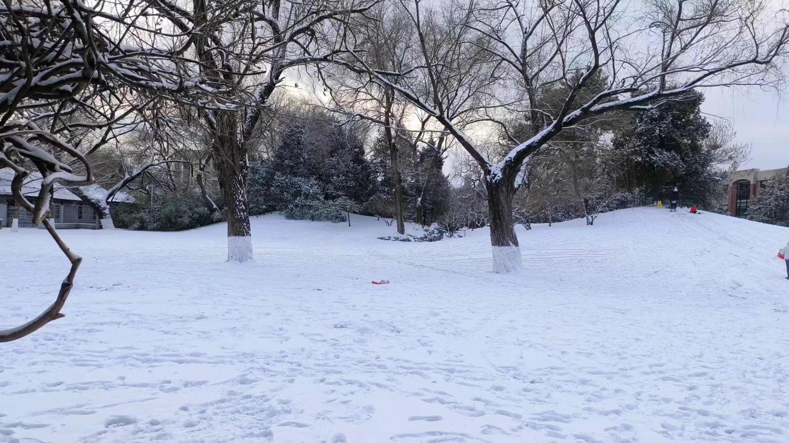
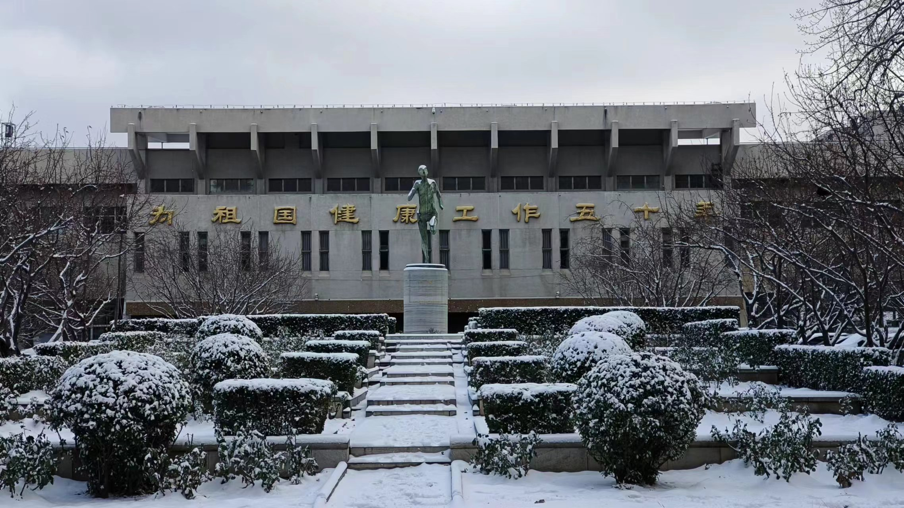
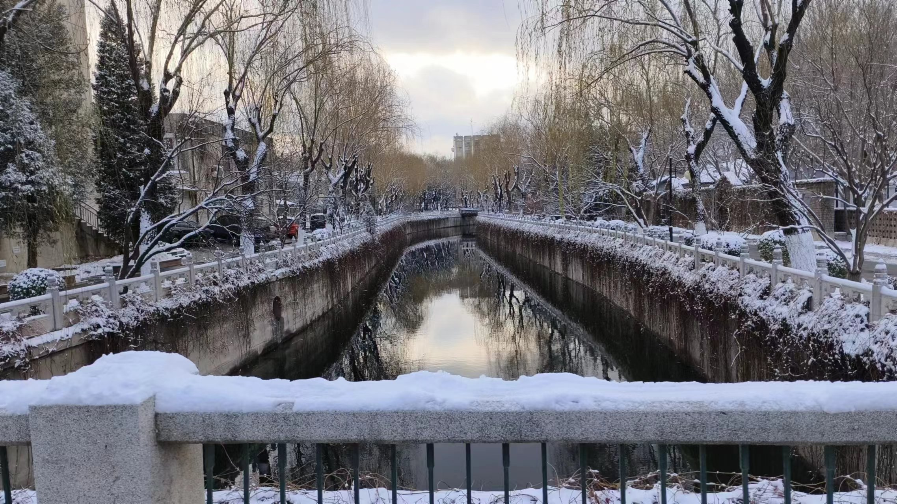

+++
date = '2023-12-11T00:00:00+08:00'
draft = false
title = '雪'
aliases = ['/2023/12/11/雪/']
tags = ['随笔']
categories = ['Misc']
+++
本来是不喜欢冬天的。

原来顶喜欢的季节是秋天。漫步街头，总能与一片飘然坠于身前的落叶不期而遇。爱极了这种意料之外的邂逅。

后来听过 luna 的[あの夏のいつかは（在那個夏日的某天）](https://www.bilibili.com/video/BV1ka4y1E7ik/?spm_id_from=333.337.search-card.all.click&vd_source=bd539b5a62c295726bece82272cc6c5a)，夏天在我心中的地位渐渐变得与秋天不分伯仲了。每次看这首曲子的 pv，都深为夏的热烈激动不已：“正是无数个微小片刻，汇集在一起造就这热烈的我”。生命本该如此。

但是，提到“冬”这个字，浮现在脑海中的总是凛冽的风、凋零的树、蜷缩的人……讨厌这种万事万物都被压抑的感觉：生命似乎被严酷的冬冰封了起来，待到来年春暖花开的时节，才能重焕生机。冬天少了点灵魂。

后来才渐渐发现我错了。冬不是没有灵魂；相反，冬的灵魂甚至比其他三个季节都更加可爱——这正是那名为“雪”的精灵。雪洁白、轻盈、古灵精怪，冬天的沉闷因为她的到来一扫而空。“忽如一夜春风来，千树万树梨花开。”被雪点缀后的世界，焕发出不亚于春的勃勃生机。人们不再蜷缩在被窝，校园里随处可见飞舞的雪球、奇形怪状的雪人和创意百出的雪地上的图案。冬天原来是这样一个趣味盎然的季节。

独身骑行在清华园内，走走停停，停停走走，一时将诸多ddl抛在脑后，只觉心灵也因这白茫茫的雪的世界变得一片通透。终于明白原来没有一个季节是不值得喜爱的，生命中也没有一个时刻是不值得热爱的。人活在世，本该如此。

本该这样喜欢冬天啊。

